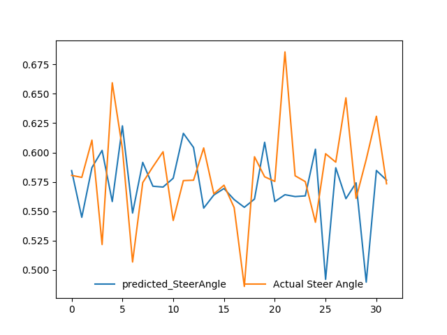

<h2> Self-Driving-Car </h2>
In this work, I try to implement simple CNN model to predict the steering angle of car given image from front camera i.e. center. 
It's an end to end learning approach from nvidia published in 2016 paper on End to End Learning for Self Driving Car
Link: https://images.nvidia.com/content/tegra/automotive/images/2016/solutions/pdf/end-to-end-dl-using-px.pdf. 

<h2> Architecture Information. </h2>
In this project I used my own architecture, I used pretrained network vgg16 trained on imagenet followed by some dense layer with elu activation function.
One can try to replicate the same architecture presented in Nvidia paper, Or can use different architecture.

<h2>Dataset Information. </h2>
A lot of self driving car dataset is available thanks to <b> Comma.ai, Udacity and many other companies </b>, But in my case due to limited resources I cannot train my model on a lot of data, So i keep it simple I trained my model on 44k images and use somewhere around 14k for validation and 4k for testing. 
The dataset I use:
<ul>
  <li>Thanks to SullyChen for making data available: https://github.com/SullyChen/driving-datasets</li>
</ul>
Other datset:
<ul>
  <li>This link include dataset from Udacity : https://github.com/udacity/self-driving-car/tree/master/datasets </li>
</ul>

<h2> Installation. </h2>
<ul>
  <li> Python==3.6.6</li>
  <li> Pytorch==1.6.0</li>
</ul>
<h2> Training Infomation & Preprocessing. </h2>
Model is trained for only 1 epoch due to limited resources, I normalize the data as well as try different approaches like calibrating a Steering Angle , Perform data Argumentation techniques. The code contain only two file one is dataset.py which contain the data loader class another is model.py file which contain model and main loop.
<h2> Prediction vs Groundtruth (Steering Angle) </h2>
Result may not be impressive, I am repeating again it's not trained for large epoch as well data it is trained on is very less.

<h2> Alert & Contribute. </h2>
I want to say that it is only for research purposes and using this in physical device can be dangerous. Please point out any mistake that i have done or you think if something is wrong, I am also new in this field and please feel free to contribute.
